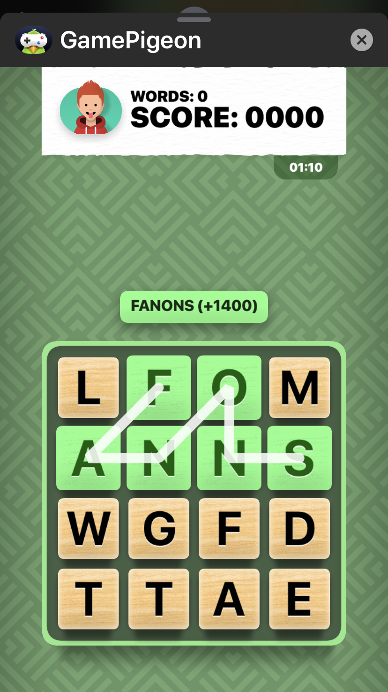

# Word Hunt Solver
Word Hunt Solver is a program to output all solution words to the iMessage game Word Hunt.

## Intoduction

Word Hunt is a popular iMessage game where two players compete to find the greatest number of words in a 4x4 board of letters within 80 seconds. Players can form words by connecting letters which are directly adjacent. An example board where a player is submitting a word can be seen in the screenshot below:


Words must be at least three letters long, and points are assigned to each word according to their length. The player with the highest score at the end of the 80 seconds is declared the winner.

## Installation

To use Word Hunt Solver, first clone this repository. In the directory in which wordhunt is cloned, run the following in the command prompt/terminal:
```bash
make newsolution
```

## Usage

Run the following in the directory:
```bash
./newsolution
```
The program will ask you to enter the board as one line of letters, starting from left to right and top to bottom. After submitting, the program will output a list of all solution words to the board, in increase point-value order. Below shows an excerpt of an output from the program:


The coordinates indicate the row number (top to bottom) and column number (left to right) of the appropriate starting point for the associated word. The list afterwards indicates the directions necessary to create the word. (U = up, D = down, L = left, R = right, UL = up-left diagonal, UR = up-right diagonal, DL = down-left diagonal, DR = down-right diagonal). Duplicates (multiple paths to create the same word) are not shown.

NOTE: words.txt contains the word bank of all words determined to be valid. However, this may not be the exact word bank used by iMessage/Game Pigeon. To change the word bank, replace words.txt with the appropriate list of words. cleanwords.py can be used to clean the word bank to contain only words with alphabetic characters.